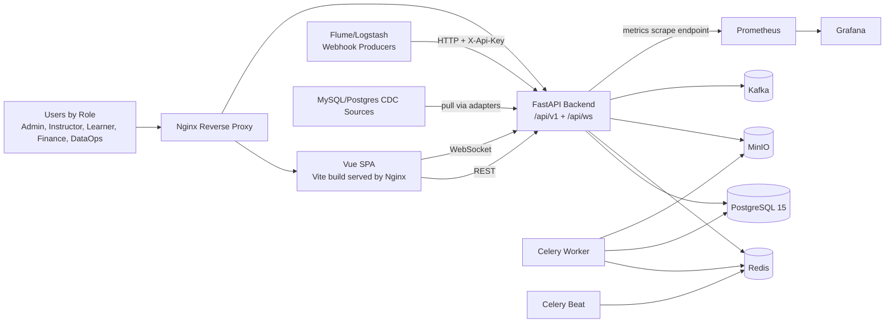
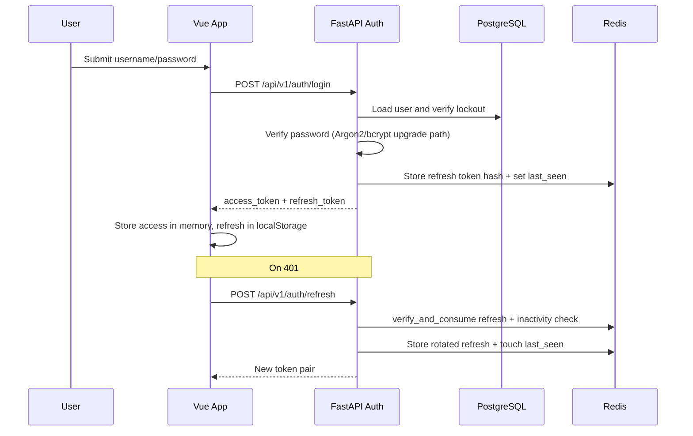
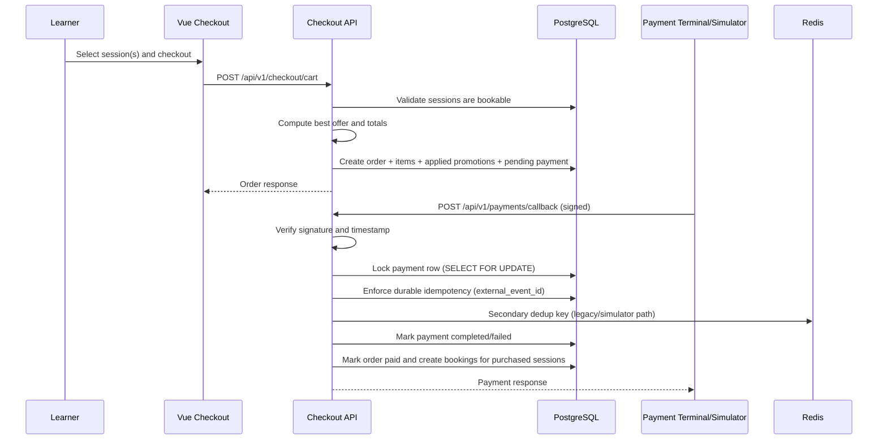
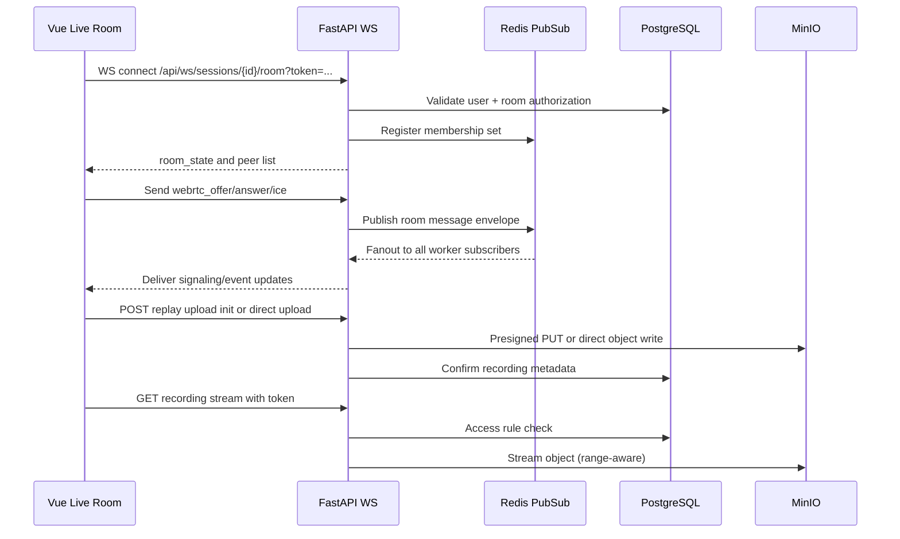
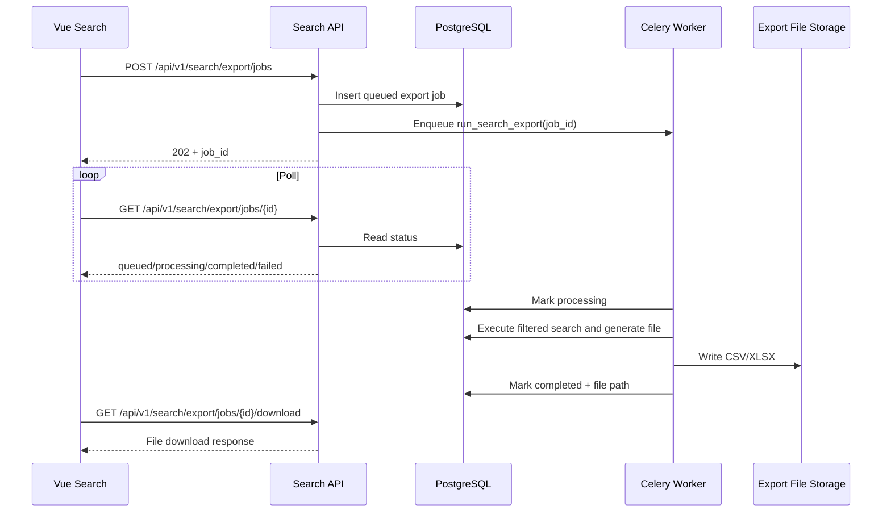

# Meridian Training Operations System - Design

## 1. System Understanding

### 1.1 Product Scope
Meridian is an offline-first training operations platform that supports:
- Session scheduling (single and recurring)
- Live room participation and post-session replay
- Booking and checkout with promotion logic
- Payment callback processing and refund lifecycle
- Operational search and large export jobs
- Multi-source data ingestion and job monitoring

### 1.2 Technology Inventory (As Implemented)
- Frontend: Vue 3 + TypeScript + Vite + Pinia + Vue Router + Axios + TailwindCSS
- Backend: FastAPI (Python 3.11), SQLAlchemy async ORM, Pydantic
- Database: PostgreSQL 15
- Queue and cache: Redis
- Job processing: Celery worker + Celery beat
- Streaming ingestion: Kafka (plus Flume/Logstash webhook support)
- Object storage: MinIO (S3-compatible)
- Reverse proxy: Nginx
- Monitoring: Prometheus + Grafana

### 1.3 Architecture Style
The system is a modular monolith backend plus supporting infrastructure services.

Characteristics:
- Single deployable backend API process with domain modules
- Shared relational database for strong consistency
- Sidecar-style async workers for background processing
- Event-assisted behavior via Redis pub/sub and Celery queue

This is not a microservice architecture; module boundaries are in-code rather than networked service boundaries.

## 2. High-Level Architecture

### 2.1 System Overview
Users interact with a Vue SPA served through Nginx. The SPA calls a FastAPI backend for all API operations and establishes WebSocket connections for live room behavior. FastAPI persists business data in PostgreSQL, uses Redis for token/session state and pub/sub coordination, and delegates asynchronous jobs to Celery worker processes. Recordings and uploaded objects are stored in MinIO. Monitoring data is scraped by Prometheus and visualized in Grafana.

### 2.2 Architecture Diagram

### 2.3 Major Components and Interactions
- Frontend web app:
  - Role-specific pages and route guards
  - API calls through centralized Axios client
  - Live-room WebSocket client for real-time state and signaling
- Backend API:
  - Auth, RBAC, business rules, validation
  - JSON response envelope middleware for consistent contracts
  - Domain modules (sessions, bookings, payments, search, ingestion, jobs, etc.)
- Database:
  - PostgreSQL as system of record
  - UUID PK model and relational constraints
- Infrastructure:
  - Redis for blocklist/refresh/inactivity state, dedup keys, pub/sub, Celery broker
  - Celery worker + beat for recurring and queued tasks
  - MinIO for recording object storage and presigned upload/download
  - Kafka and CDC adapters for ingestion
  - Prometheus/Grafana for operational observability

## 3. Frontend Design

### 3.1 Framework and Libraries
- Vue 3 composition API with TypeScript
- Routing: Vue Router (history mode)
- State: Pinia domain stores (`auth`, `sessions`, `bookings`, `checkout`, `search`, `jobs`, `ingestion`, `ui`)
- API communication: Axios with interceptors
- Forms and validation: vee-validate + yup
- UI: TailwindCSS + Radix Vue + lucide icons

### 3.2 Component Structure and Hierarchy
Typical hierarchy:
- `main.ts` bootstraps app with Pinia and router
- `App.vue` hosts route view and theme initialization
- Layouts:
  - `AuthLayout.vue` for login/change-password flows
  - `AppLayout.vue` for authenticated shell (sidebar, topbar, alerts, theme toggle)
- Pages grouped by role/domain:
  - `pages/admin/*`, `pages/instructor/*`, `pages/learner/*`, `pages/finance/*`, `pages/dataops/*`
- Reusable components:
  - Shared alerts, toasts, tables, status badges, calendar widgets, live room modal

### 3.3 State Management Approach
Pinia stores encapsulate both state and orchestration logic:
- `auth` store:
  - Access token in memory, refresh token in localStorage
  - Session restore and client-side inactivity mirror
- Domain stores:
  - API-backed fetch/mutate functions
  - Local loading/error state
- `ui` store:
  - Theme and sidebar persistence
  - Toast notifications

### 3.4 Routing Strategy
- Route table defines role-constrained paths using `meta.roles`
- Global guard behavior:
  - Allows public routes (`/login`, `/403`, etc.)
  - Attempts `restoreSession()` for unauthenticated users with refresh token
  - Enforces RBAC and redirects unauthorized users to `/403`
- Home route redirects by authenticated role to role dashboard

### 3.5 API Communication Layer
The Axios client provides:
- Bearer token injection on each request
- Multipart-safe header behavior for upload endpoints
- Automatic 401 refresh flow with queued retry of concurrent requests
- Standard error normalization
- Automatic envelope unwrapping for `{ data, meta, error }`

### 3.6 Key UI/UX Patterns
- Role-specific navigation generated from current role
- Long-running actions reflected with toasts and loading states
- Search export uses async job + polling UX
- Session detail page combines booking, attendance, replay, and live-room entry
- Light/dark theme with persisted preference

## 4. Backend Design

### 4.1 Framework and Structure
Backend is organized by modules under `backend/app/modules/<domain>`.

Typical files per module:
- `controller.py`: FastAPI router and HTTP contract
- `service.py`: business logic and orchestration
- `repository.py`: DB access abstractions (where used)
- `models.py`: SQLAlchemy ORM models
- `schemas.py`: Pydantic DTOs

Cross-cutting core modules:
- `core/config.py`: typed settings from environment
- `core/deps.py`: auth and role dependencies
- `core/security.py`: hashing, JWT, token/session Redis helpers
- `core/exceptions.py`: custom exceptions + response envelope middleware
- `core/audit.py`: audit writes with tamper-evident hash chain
- `core/storage.py`: MinIO storage abstraction

### 4.2 API Design Principles
- REST APIs under `/api/v1`
- One WebSocket endpoint family under `/api/ws`
- Standard JSON envelope for API consistency
- Pydantic validation on request/response models
- Role checks via dependency-injected RBAC
- Clear status-code semantics (401/403/404/409/422/423)

### 4.3 Authentication and Authorization
Auth model:
- Offline username/password login
- JWT access and refresh tokens
- Refresh token rotation with one-time consume semantics

Security controls:
- Password complexity policy and Argon2 default hashing
- Failed-login lockout (max attempts + lock window)
- Access-token blocklist in Redis
- Inactivity timeout enforced server-side using Redis `last_seen`
- Role-based endpoint constraints via `require_roles(...)`

WebSocket auth:
- Access token passed as query parameter
- Token validation + blocklist check
- Additional room authorization checks (admin/instructor/confirmed learner)

### 4.4 Business Logic Organization
Core business domains:
- Sessions and recurrence, room/instructor conflict checks
- Booking lifecycle and policy-aware cancellation behavior
- Checkout cart pricing and promotion application
- Payment callback verification and order transition management
- Refund state machine
- Replay access policy and view tracking
- Search with role-scoped filtering and optional facets
- Ingestion source management and run execution
- Job telemetry, health, and alerts

### 4.5 Background Jobs and Async Processing
Celery handles recurring and queued work:
- Recurring schedules from beat:
  - Close expired orders
  - Attendance rollup
  - Replay access expiry
  - Reconciliation export
  - Audit log purge
  - Job-health checks
  - Ingestion runs
- Queued one-off jobs:
  - Search export processing

Reliability behavior:
- Retries with exponential backoff for many tasks
- Job execution records persisted for monitoring/analytics
- Alert generation for high failure rate and late jobs

## 5. Database Design

### 5.1 Database Type
- PostgreSQL 15 relational database
- UUID primary keys throughout
- Timezone-aware timestamps (UTC)
- Extensions: `uuid-ossp`, `pg_trgm`

### 5.2 Core Schema Domains and Relationships
Identity and access:
- `users` with role enum and encrypted/masked contact fields

Scheduling:
- `locations` -> `rooms`
- `courses`
- `instructors` (linked to users)
- `recurrence_rules`
- `sessions` (FK to course, instructor, room, recurrence rule)

Enrollment and attendance:
- `bookings` (session + learner)
- `attendance_records` (session + learner, timings)

Replay/media:
- `replay_access_rules`
- `session_recordings`
- `replay_views`

Commerce:
- `promotions`
- `orders` -> `order_items`, `order_promotions`
- `payments` (1:1 order) and `refunds`
- `reconciliation_exports`

Search and ingestion:
- `saved_searches`
- `search_export_jobs`
- `ingestion_sources` and `ingestion_runs`

Ops and governance:
- `job_executions`, `monitoring_alerts`
- `audit_logs` with `prev_hash` and `entry_hash`
- `admin_policies` (singleton)

### 5.3 Indexing Strategy
Notable indexing patterns:
- Access and lookup indexes on FK and status columns
- Time indexes for schedule and job windows
- Text search/index support:
  - `users` GIN full-text vector index
  - `orders` trigram index on order-id text cast for invoice-like lookups
- Job/status indexes for operational queries
- Search export job status/created indexes for polling

### 5.4 Migration Approach
- Alembic migration chain under `backend/alembic/versions`
- `env.py` maps async DB URL to sync driver for migration execution
- Migrations include schema evolution for security hardening and async export jobs
- Container entrypoint runs `alembic upgrade head` at startup

## 6. Data Flow

### 6.1 Flow A: Login and Session Renewal

### 6.2 Flow B: Checkout to Payment Callback to Booking

### 6.3 Flow C: Live Session and Replay Lifecycle

### 6.4 Flow D: Async Search Export

## 7. Integration Points

### 7.1 Third-Party and Platform Integrations
- Redis:
  - JWT blocklist
  - Refresh token hash keys
  - Inactivity/last-seen tracking
  - Callback dedup keys
  - WebSocket room membership and pub/sub fanout
  - Celery broker/result backend
- MinIO:
  - Recording uploads and downloads
  - Presigned URLs and direct-stream support
- Kafka:
  - Batch consumption ingestion source type
- CDC connectors:
  - MySQL and PostgreSQL pull adapters
- Logstash/Flume:
  - Push ingestion via authenticated webhook
- Prometheus/Grafana:
  - Metrics scrape endpoint and dashboards
- LAN payment terminal/simulator:
  - Signed callback endpoint for payment completion events

### 7.2 Why They Are Used
- Redis unifies low-latency shared state and queue plumbing
- MinIO provides self-hosted object storage for offline/local deployments
- Kafka and CDC sources support both streaming and incremental integration
- Prometheus/Grafana provide local observability without cloud dependency
- Callback-based payment supports on-prem terminal workflows

### 7.3 Failure Handling and Retries
- Celery retries with backoff on transient job failures
- Payment callback idempotency:
  - Durable DB unique key (`external_event_id`)
  - Secondary Redis fingerprint fallback
- WebSocket subscriber supervised restart loop on backend lifespan
- Source connectivity test endpoints before ingestion runs
- Job health alerts for error-rate and lateness thresholds

## 8. Non-Functional Requirements

### 8.1 Scalability Strategy
Current strategy:
- Horizontal backend processes behind Nginx
- Async DB sessions and pooled SQLAlchemy engine
- Offloaded heavy work to Celery worker
- Async export jobs to avoid long blocking HTTP requests

Scale limits and posture:
- Modular monolith simplifies consistency but limits independent scaling per domain
- Redis and PostgreSQL are central shared dependencies; HA setup is required for larger deployments

### 8.2 Performance Considerations
- Query pagination and max page-size controls
- Search export hard row limit (50,000)
- Targeted indexing on time, status, and foreign keys
- Trigram and FTS indexes for search-like behavior
- Streaming responses for replay video with range support

### 8.3 Security Practices
- Argon2-first password hashing, complexity policy, lockout controls
- JWT access/refresh lifecycle with revocation and inactivity enforcement
- RBAC across API routes and WebSocket admission
- HMAC signature verification for payment callbacks
- Sensitive data encryption at rest (`email`, `phone`, ingestion configs)
- PII masking and controlled unmask endpoint
- Tamper-evident audit chain with hash linkage

### 8.4 Reliability and Fault Tolerance
- Container healthchecks and restart policies in Compose
- Startup dependency checks in entrypoint scripts
- Job execution audit trail and monitoring alerts
- Durable relational state with explicit status machines

### 8.5 Logging and Monitoring
- Structured JSON logs with correlation/request IDs
- API health endpoint plus metrics endpoints
- Prometheus scrape token protection
- Grafana dashboards provisioned via monitoring config

## 9. Deployment and Infrastructure

### 9.1 Hosting and Runtime Model
Containerized multi-service deployment via Docker Compose:
- `nginx`: edge reverse proxy
- `frontend`: static SPA server
- `backend`: FastAPI API service
- `celery_worker`, `celery_beat`: background processing
- `db`: PostgreSQL
- `redis`: cache/queue
- `kafka`, `zookeeper`: ingestion stream stack
- `minio` (+ init): object storage
- `prometheus`, `grafana`: monitoring

### 9.2 CI/CD Pipeline Status
- No repository-native CI workflow files detected
- Test execution is standardized through `run_tests.sh` and Docker commands

Recommended CI baseline:
1. Build images
2. Run backend and frontend tests
3. Run migration check against ephemeral DB
4. Push versioned images
5. Deploy via environment-specific compose manifests

### 9.3 Environment Configuration
- Centralized via environment variables and typed settings
- `.env` pattern for local override
- Compose file includes development defaults

Environment tiers:
- Development: compose defaults with seeded admin and local secrets
- Staging/Production: strong unique secrets, no default credentials, hardened network

### 9.4 Secrets Management
Critical secrets:
- JWT signing secret
- Field encryption key
- Payment callback signature secret
- MinIO credentials
- Prometheus scrape token

Current model:
- Environment variables passed into containers

Production recommendation:
- Use a dedicated secret store/injector and rotate periodically

## 10. Design Decisions and Trade-offs

### 10.1 Key Architectural Decisions
1. Modular monolith backend over microservices
2. PostgreSQL as single source of truth for transactional consistency
3. Redis as shared operational state backbone
4. Celery for asynchronous and scheduled workloads
5. MinIO for self-hosted media storage
6. Standard API response envelope for consistent frontend handling
7. Role-based UI and backend authorization alignment

### 10.2 Alternatives Considered
- Microservices with independent databases
- Fully synchronous export generation
- Direct browser-only media access without API stream proxy
- Stateless auth without inactivity Redis state
- Event-sourced audit subsystem instead of append-only hash chain in relational table

### 10.3 Trade-offs and Reasoning
- Modular monolith:
  - Pros: lower operational complexity, simpler transactions
  - Cons: coarser deploy/scaling boundaries
- Redis-backed inactivity/token controls:
  - Pros: immediate revocation and session policy enforcement
  - Cons: additional infra dependency, volatile state recovery concerns
- Async exports/jobs:
  - Pros: predictable API latency and better UX for large operations
  - Cons: polling complexity and job-state lifecycle management
- Streaming replay via backend proxy:
  - Pros: centralized authorization and range handling
  - Cons: backend bandwidth load vs direct signed URL use
- Fire-and-forget audit insertion:
  - Pros: business flows are not blocked by audit write failures
  - Cons: potential audit gaps under severe failure (mitigated by structured error logs)

## 11. Implementation Notes and Suggested Next Enhancements

1. Add repository-level CI workflows to enforce tests and migration safety on every change.
2. Introduce environment-specific compose overlays (dev/staging/prod) and secret provider integration.
3. Add explicit SLOs for API latency, job success rate, and replay streaming reliability.
4. Consider dedicated read-model optimization for operational search as data volume grows.
5. Add resilience tests for Redis restart and callback replay storm scenarios.
